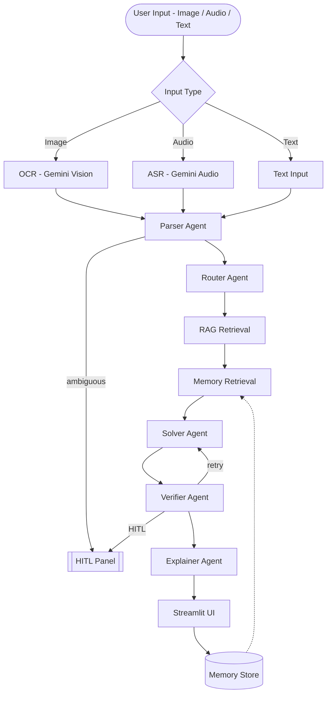

# 🧮 Math Mentor

> A reliable multimodal math tutor for JEE-level problems.  
> Built with RAG, multi-agent orchestration (LangGraph), HITL, and memory.  
> Powered by **Google Gemini**.

[](https://your-app-link.streamlit.app)

---

## Architecture



## Agents

| Agent | Role |
|---|---|
| Parser | Cleans OCR/ASR output → structured JSON |
| Router | Classifies topic + picks solution strategy |
| Solver | Solves using RAG context + Python calculator |
| Verifier | Checks correctness, domain, edge cases |
| Explainer | Produces student-friendly explanation |

## Setup

```bash
# 1. Clone
git clone https://github.com/your-username/math-mentor.git
cd math-mentor

# 2. Install dependencies
python -m venv .venv && source .venv/bin/activate
pip install -r requirements.txt

# 3. Configure environment
cp .env.example .env
# Edit .env and add your GEMINI_API_KEY

# 4. Ingest knowledge base
python scripts/ingest_kb.py

# 5. Run the app
streamlit run ui/app.py
```

## CLI Usage

```bash
python main.py "Find the derivative of x^3 sin(x)"
python main.py --ingest-kb
```

## Deployment (Streamlit Cloud)

1. Push repo to GitHub
2. Go to [share.streamlit.io](https://share.streamlit.io)
3. Connect repo → set `ui/app.py` as entry point
4. Add `GEMINI_API_KEY` in Secrets

## Project Structure

```
math-mentor/
├── agents/          # LangGraph agents + graph orchestration
├── rag/             # RAG pipeline + knowledge base docs
├── memory/          # SQLite + ChromaDB memory layer
├── tools/           # OCR, ASR, calculator tools
├── ui/              # Streamlit app + components
├── scripts/         # One-time setup scripts
├── config.py        # Central config (reads .env)
├── main.py          # CLI entrypoint
└── requirements.txt
```

## License

MIT
